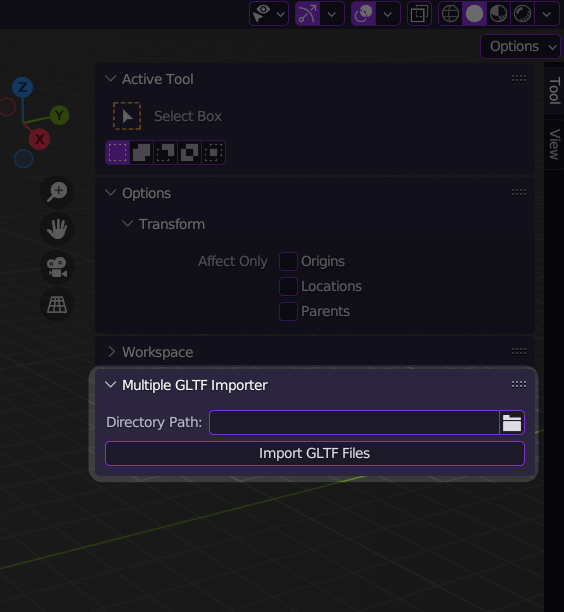

# Auto glTF Files Importer (Blender 3D)

This is a script finds all glTF files (recursively) and imports in Blender.

## Usage

To use this script, follow these steps:

1. Paste/import py file to Blender Text Editor;
2. Edit directory value in code;
  
3. Run the script.
